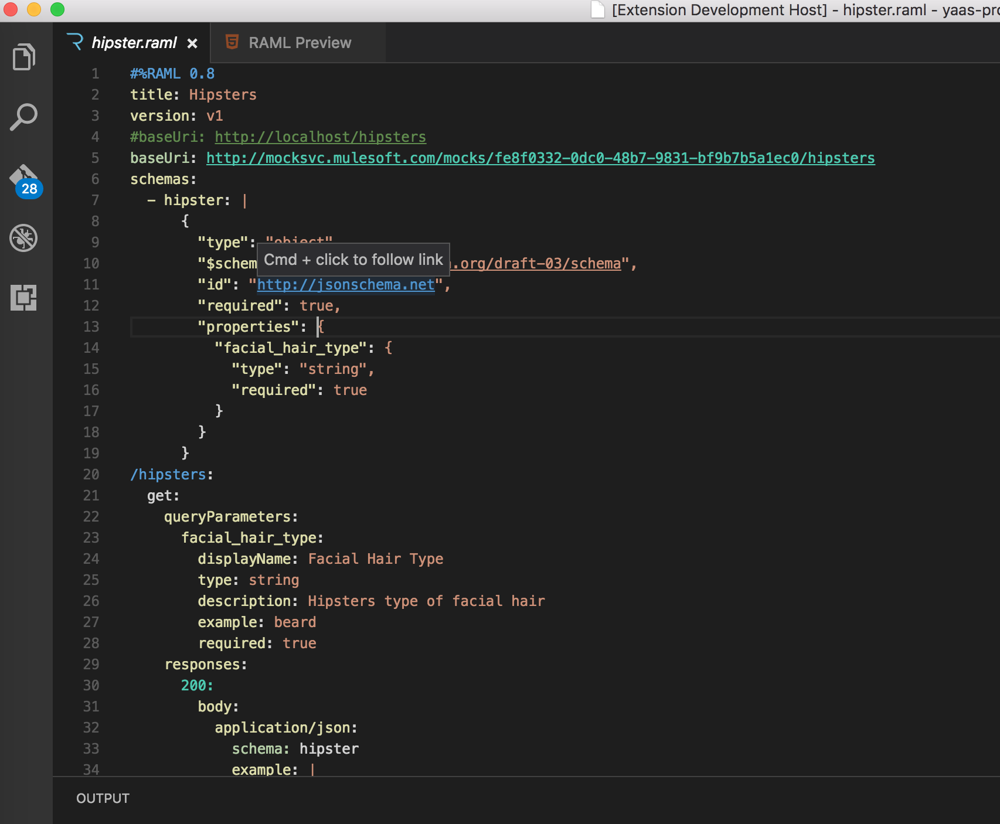
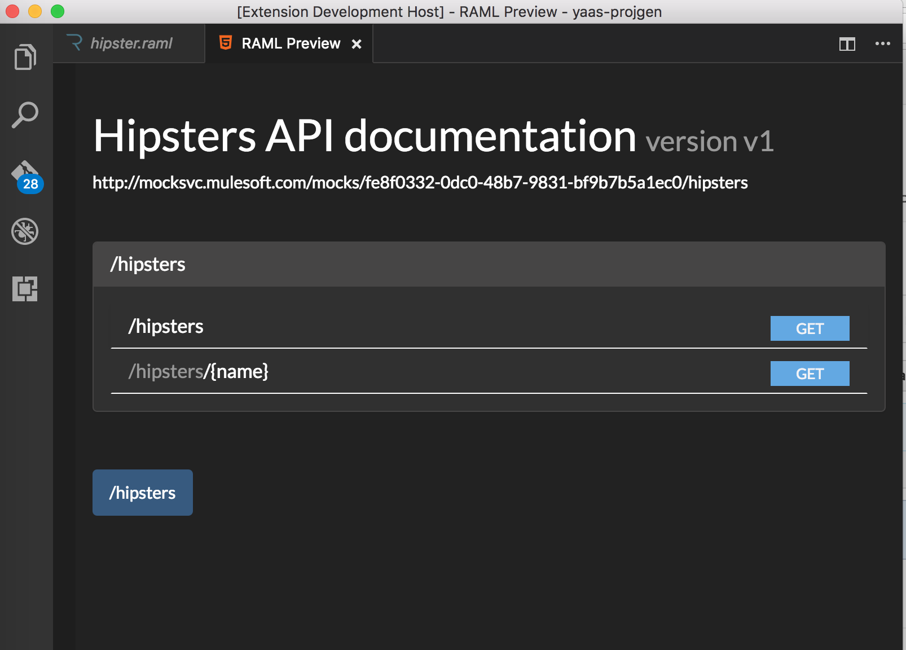

# RAML Syntax Highlighting for Visual Studio Code
This is a RAML preview and syntax highlighting implementation for VS Code based on [jlandersen/vscode-raml](https://github.com/jlandersen/vscode-raml) project, and [raml2html](https://github.com/raml2html/raml2html).

## Screenshot

